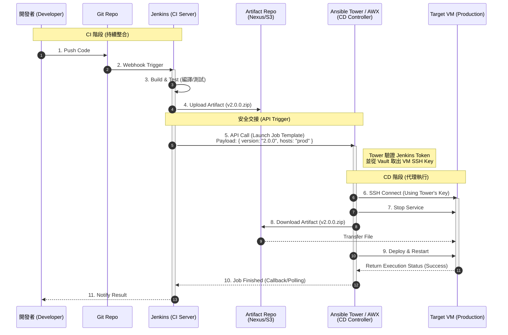

# Jenkins + Ansible Tower (AWX)：高安全性 VM 部署流程

此文件使用時序圖說明如何透過 **Ansible Tower (或開源版 AWX)** 作為中間協調者，隔離 Jenkins 與目標伺服器 (VM) 的直接連線，實現金鑰不落地的安全部署。

## 1. 架構對比：CLI vs Tower

在閱讀此流程前，先了解為何要從「直接執行 Ansible CLI」升級為「使用 Ansible Tower」。

| 比較項目 | Jenkins + Ansible CLI (一般版) | Jenkins + Ansible Tower (安全版) |
| :--- | :--- | :--- |
| **文件參照** | [Jenkins_Ansible_VM_Workflow.md](./Jenkins_Ansible_VM_Workflow.md) | **本文件** |
| **金鑰保管者** | **Jenkins** (存在 Credentials Store) | **Tower** (存在 Tower Vault) |
| **Jenkins 權限** | **高** (持有 VM SSH Key) | **低** (僅持有 Tower API Token) |
| **執行方式** | Jenkins 直接連線 VM | Jenkins 呼叫 Tower API -> Tower 連線 VM |
| **資安風險** | Jenkins 被駭 = 駭客取得 SSH Key | Jenkins 被駭 = 駭客無法取得 SSH Key |
| **適用場景** | 中小型團隊、快速開發 | 金融/大型企業、高合規需求 |

---

## 2. 核心架構概念 (Key Isolation)

在此架構中，**Jenkins 不持有目標 VM 的 SSH Private Key**。
*   **Jenkins (CI)**：持有 Ansible Tower 的 API Token。
*   **Ansible Tower (CD)**：持有目標 VM 的 SSH Private Key (存放在加密的 Credentials 中)。
*   **流程**：Jenkins 透過 HTTP API 請求 Tower 啟動作業，Tower 再使用內部的金鑰連線至 VM。

---

## 3. 部署時序圖 (Sequence Diagram)

---

## 4. 流程詳細說明

### CI 階段 (Jenkins)
*   Jenkins 執行標準的編譯與測試流程。
*   產出 Artifact 並上傳至儲存庫。
*   **差異點**：Jenkins 不需要準備 SSH Key，只需要準備呼叫 Ansible Tower API 的 `auth_token`。

### 觸發階段 (Jenkins -> Tower)
*   Jenkins 使用插件 (Ansible Tower Plugin) 或 `curl` 指令，向 Tower 發送 POST 請求。
*   **傳遞參數**：
    *   `limit`: 指定部署目標（如 `web-servers`）。
    *   `extra_vars`: 傳遞版本號（如 `{"app_version": "2.0.0"}`）。

### CD 階段 (Tower -> VM)
*   Tower 收到請求後，載入對應的 **Job Template**。
*   **權限注入**：Tower 自動掛載它所保管的 **Machine Credential (SSH Key)**。
*   **執行部署**：Tower 連線至 VM 執行 Playbook。

### 回報結果
*   Tower 執行完畢後，會回傳 HTTP 200/500 給 Jenkins，或者 Jenkins 主動輪詢 (Poll) Tower 的作業狀態，確認部署是否成功。

---

## 5. 資安優勢總結

1.  **攻擊面隔離**：如果駭客攻破 Jenkins，他們只能拿到「Tower API Token」。他們可以觸發部署，但**無法取得 SSH Key**，因此無法登入 VM 竊取資料或植入後門。
2.  **稽核紀錄 (Audit Log)**：Ansible Tower 會詳細記錄「誰 (Jenkins) 在什麼時候呼叫了哪個 Job」，以及 Playbook 執行的完整 Log，比單純的 Jenkins Console 更易於追蹤。
3.  **RBAC 控管**：可以在 Tower 上設定細緻的權限，例如限制 Jenkins 的帳號只能觸發「部署到測試區」，而不能觸發「部署到正式區」。