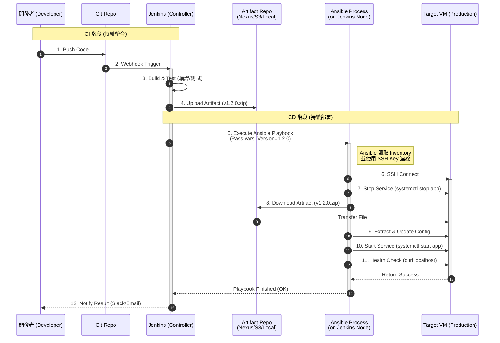

# Jenkins + Ansible：VM/實體機自動化部署流程

此文件使用時序圖說明在虛擬機 (VM) 或實體伺服器環境中，如何結合 Jenkins (CI) 與 Ansible (CD) 實現自動化部署。

## 核心架構概念

*   **Jenkins (指揮官)**：負責排程、建置 Artifact，並保存部署所需的憑證 (SSH Keys) 透過 Credential Binding 注入環境變數。
*   **Ansible (執行者)**：負責實際連線到目標伺服器，執行冪等性 (Idempotent) 的部署腳本 (Playbook)。
*   **Inventory**：定義目標伺服器的清單檔案 (Hosts)。

---

## 部署時序圖 (Sequence Diagram)



---

## 流程詳細說明

### 1. CI 階段：產出部署包
*   Jenkins 拉取程式碼並進行編譯。
*   測試通過後，將編譯好的檔案（Artifact）上傳到儲存庫（如 Nexus, Artifactory, S3, 或僅暫存在 Jenkins Workspace）。
*   **關鍵點**：Jenkins 必須確定本次部署的「版本號」或「檔案路徑」。

### 2. 觸發 Ansible (Handover)
Jenkins 透過 `Ansible Plugin` 或直接執行 `sh "ansible-playbook ..."` 來啟動部署。
在此步驟，Jenkins 會將重要參數傳遞給 Ansible：
*   **Inventory**：告訴 Ansible 要部署到哪一台機器（例如 `-i hosts/prod`）。
*   **Extra Vars**：傳遞動態參數（例如 `-e "app_version=1.2.0"`）。
*   **Credentials**：Jenkins 負責解密 SSH Private Key 並注入到 Ansible 的執行環境中。

### 3. CD 階段：Ansible 執行部署
Ansible 根據 Playbook 的定義，依序對目標 VM 執行任務：
*   **管理服務**：確保應用程式停止，避免檔案鎖定。
*   **更新檔案**：使用 `get_url` 或 `copy` 模組，將新版 Artifact 下載到 VM 指定路徑。
*   **組態管理**：使用 `template` 模組更新設定檔（如 `app.conf`），這點是 Ansible 的強項。
*   **重啟與驗證**：重啟服務並透過 `uri` 模組檢查服務是否回應 200 OK。

---

## 常見 Jenkinsfile 整合範例

```groovy
pipeline {
    agent any
    environment {
        // 在 Jenkins 憑證管理中設定好的 SSH Key ID
        SSH_KEY = credentials('prod-ssh-key')
    }
    stages {
        stage('Build') {
            steps {
                sh './build.sh' // 產出 app-v1.0.jar
            }
        }
        stage('Deploy to VM') {
            steps {
                // 使用 Ansible Plugin 或 Shell
                sh """
                  ansible-playbook -i inventory/prod deploy.yml \
                  --private-key $SSH_KEY_USR \
                  -e "artifact_path=./target/app-v1.0.jar"
                """
            }
        }
    }
}
```