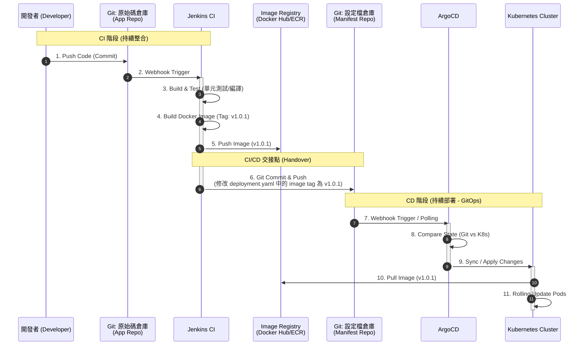

# Jenkins + ArgoCD：Kubernetes GitOps 部署流程

此文件使用時序圖說明在 Kubernetes 環境中，如何結合 Jenkins (CI) 與 ArgoCD (CD) 實現 GitOps 自動化流程。

## 核心架構概念

在此架構中，**Jenkins 不需要 K8s Cluster 的 Admin 權限**。
Jenkins 的唯一職責是產出 Docker Image，並修改 Git 上的設定檔 (Manifest)。ArgoCD 則負責監聽該 Git 設定檔的變動並同步至 K8s。

---

## 部署時序圖 (Sequence Diagram)

---

## 流程詳細說明

### 第一階段：CI (Jenkins)
1.  **Push Code**：開發者將程式碼推送到應用程式原始碼倉庫 (App Repo)。
2.  **Build & Test**：Jenkins 被觸發，執行編譯、程式碼掃描與單元測試。
3.  **Push Image**：Jenkins 打包 Docker Image 並推送到 Registry (如 Harbor, ECR, Docker Hub)。
4.  **Update Manifest (關鍵步驟)**：
    *   Jenkins 執行腳本（如 `sed` 或 `yq`）修改 **設定檔倉庫 (Manifest Repo)** 中的 `values.yaml` 或 `deployment.yaml`。
    *   例如：將 `image: myapp:v1.0.0` 修改為 `image: myapp:v1.0.1`。
    *   Jenkins 將此變更 Commit 並 Push 回 Git Config Repo。

### 第二階段：CD (ArgoCD)
5.  **Detect Change**：ArgoCD 偵測到 Config Repo 發生變動（透過 Webhook 通知或每 3 分鐘自動輪詢）。
6.  **Sync (同步)**：ArgoCD 比對 Git 上的新設定與 K8s 叢集內的現狀 (Live State)。
7.  **Apply**：ArgoCD 指揮 K8s 進行更新（例如執行 Rolling Update）。
8.  **Pull Image**：K8s Node 根據新的 yaml 設定，從 Registry 拉取新的 Image 並啟動 Pod。

## 優點總結
*   **權限隔離**：Jenkins 不需要 K8s 的 `kubeconfig` 或任何存取權限，降低 CI Server 被駭後的風險。
*   **版本紀錄**：所有的部署變更都記錄在 Git Config Repo 的 Commit Log 中，隨時可以 `git revert` 回滾版本。
*   **狀態一致性**：ArgoCD 確保 K8s 實際運作狀態永遠與 Git 描述的一致。
